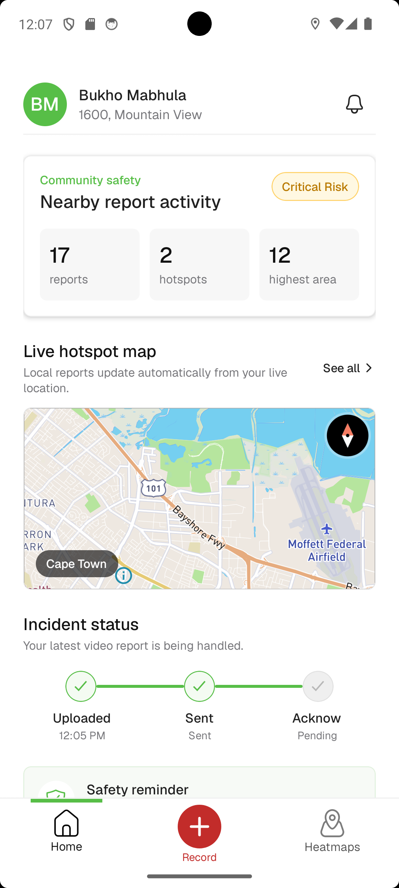
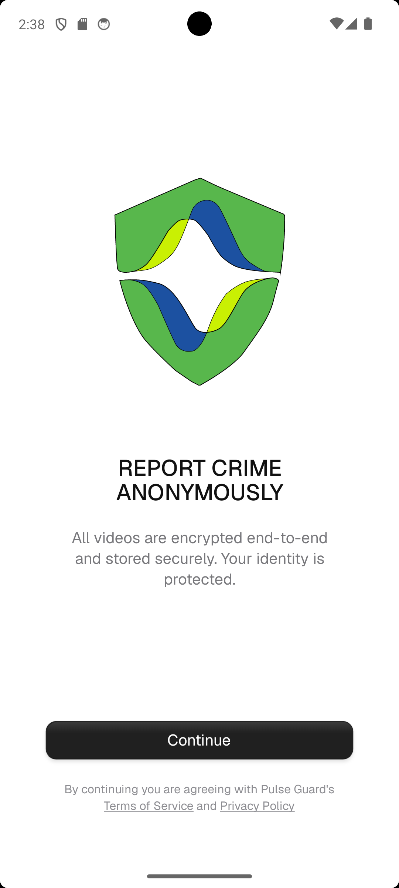
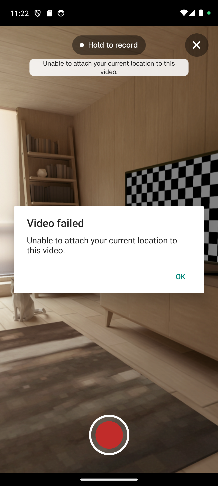
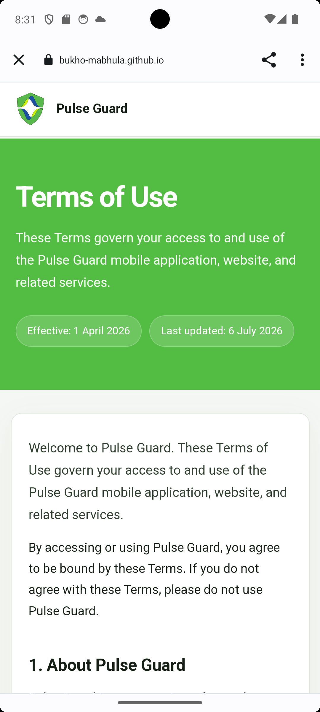
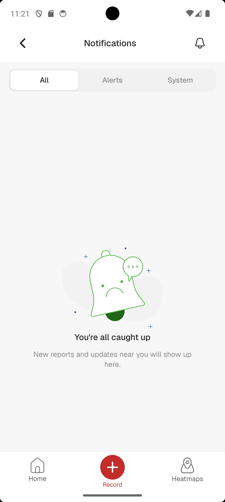

# Pulse Guard

Pulse Guard is a mobile safety app designed to help users stay informed, report incidents, and access safety tools quickly.

## Overview

- Track nearby safety activity through the home and heatmap experience
- Review notifications and incident updates in one place
- Capture and upload video evidence when needed
- Access onboarding, privacy, and legal information from the app

## Features

- Safety dashboard with key actions and quick access
- Incident and notification flow for ongoing awareness
- Media capture support for reporting and documentation
- Privacy-first settings and legal screens

## Screenshots

### Home



### Onboarding



### Video recording



### Terms and policy



### Notifications



## Getting started

1. Install dependencies:

   ```bash
   npm install
   ```

2. Start the Expo app:

   ```bash
   npx expo start
   ```

3. Open the app in an emulator, simulator, or Expo Go.

## Project structure

- `app/` — app screens and navigation
- `components/` — reusable UI components
- `context/` — app state and context providers
- `services/` — API and platform integrations
- `assets/` — images, icons, and screenshots

## License

This project is for demonstration and development purposes.
